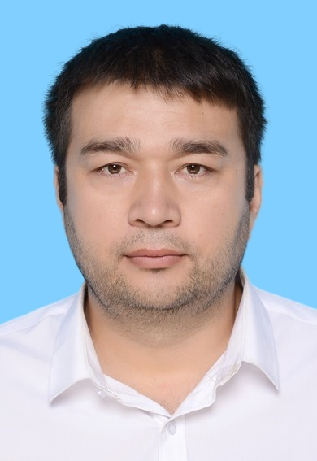

# Sharofiddin Allaberdiev — Personal Academic Website

Live at: `https://YOUR-USERNAME.github.io`

---

## How to publish in 5 minutes

### Step 1 — Create GitHub account
Go to https://github.com and sign up (free).

### Step 2 — Create a repository
- Click the green "New" button
- Repository name MUST be: `YOUR-USERNAME.github.io`
  - Example: if your username is `sharofiddin-a`, the repo name is `sharofiddin-a.github.io`
- Set it to **Public**
- Click "Create repository"

### Step 3 — Upload files
- Click "uploading an existing file"
- Drag and drop `index.html` from this folder
- Click "Commit changes"

### Step 4 — Enable GitHub Pages
- Go to Settings → Pages
- Source: Deploy from branch → main → / (root)
- Click Save

### Step 5 — Your site is live!
Wait 1-2 minutes then visit: `https://YOUR-USERNAME.github.io`

---

## How to update later

Any time you want to edit the site:
1. Open `index.html` in any text editor (Notepad, VS Code, etc.)
2. Make your changes
3. Go to your GitHub repo → click `index.html` → click the pencil icon (Edit)
4. Paste your updated content → Commit

---

## Optional: Add your photo
1. Save your photo as `photo.jpg` in the same folder
2. In `index.html`, find the `<div class="avatar-circle">SA</div>` line
3. Replace it with:
```html

```

---

## Optional: Add your CV file
- Upload your CV doc to the repo
- The "Download CV" button in the site already links to it

---

## Sections in this site
- Hero — name, title, quick links
- Stats — publications, countries, languages
- Research interests — 4 focus areas
- Publications — all 4 papers
- Work experience — timeline
- Education — PhD, MSc, BSc, Certifications
- Skills — programming, tools, languages
- Awards — 8 awards and scholarships
- Contact — emails, phones, open positions
